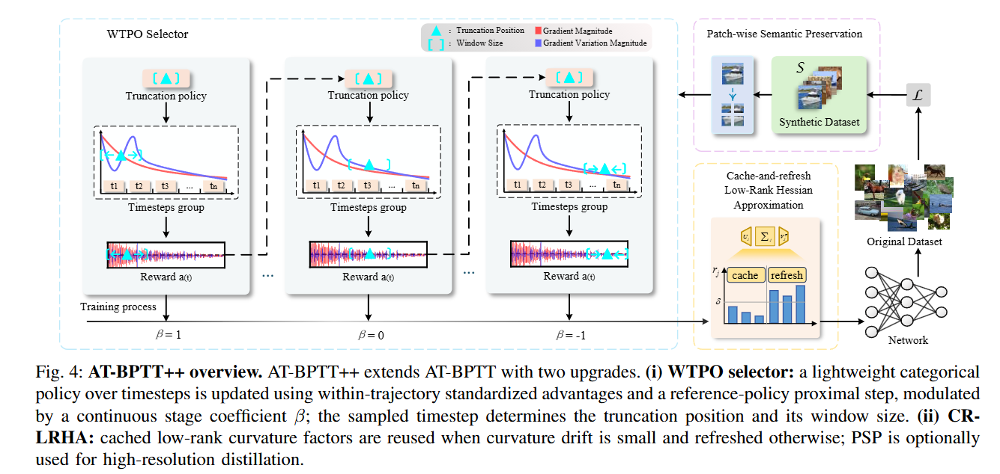
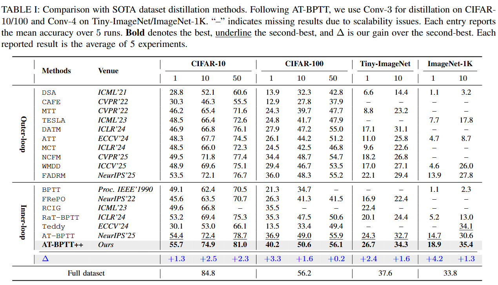
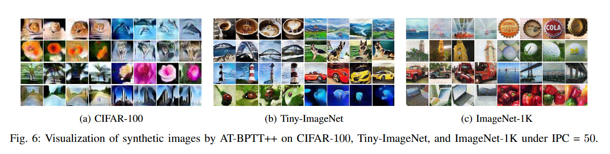

## [Beyond Random: Automatic Inner-loop Optimization in Dataset Distillation](https://github.com/GH209515338/AT-BPTT/blob/main/README.md)

---

#### [Project Page](https://github.com/aether-hang/at-bptt-plus) | [Paper]()

---
### 🧠Abstract

Dataset distillation (DD) seeks to synthesize a compact training set that can replace a large dataset with minimal loss in accuracy. A major practical challenge is *inner-loop optimization*: computing meta-gradients by differentiating through long training trajectories via backpropagation through time (BPTT) is costly in time and memory, and is further burdened by second-order curvature terms. Truncated BPTT reduces this cost, but most existing schemes rely on fixed windows or uniformly random truncation positions throughout optimization. Such one-size-fits-all truncation ignores stage-dependent learning dynamics and can yield unstable or suboptimal meta-gradient estimates under gradient-scale drift and noisy training signals. To address this, building on our previous AT-BPTT,  we present **AT-BPTT++**, an inner-loop optimization framework that improves both the robustness and efficiency of truncated meta-gradient computation. AT-BPTT++ introduces two components. First, a within-trajectory policy optimization (WTPO) selector casts the choice of truncation position and window size as a lightweight categorical policy update: per-timestep gradient statistics are standardized within each unrolled trajectory to form scale-invariant advantages, and the truncation policy is updated via a proximal step to a slowly moving reference policy. Second, Cache-and-Refresh LRHA (CR-LRHA) amortizes second-order computation by reusing cached low-rank curvature factors when a cheap drift indicator is small and refreshing them only when necessary. Across standard benchmarks and architectures, AT-BPTT++ consistently improves over prior DD inner-loop optimizers and our conference version, while reducing resource usage and improving stability under realistic noise and configuration changes. 

### ✨Introduction

We summarize our contributions as follows:

-  We present **AT-BPTT++**, an enhanced inner-loop optimization framework for bilevel DD that improves the robustness and efficiency of adaptive truncation.
- We introduce a **WTPO selector** that updates a categorical truncation policy using standardized within-trajectory advantages and a reference-policy proximal step, reducing brittle dependence on absolute scores and threshold-guided stage control.
- We propose **CR-LRHA**, a cache-and-refresh low-rank Hessian approximation that selectively reuses curvature factors under small change, reducing the amortized second-order cost without adding extra models or additional forward/backward passes.



### 📊Performance



📌AT-BPTT achieves:

✅We evaluate AT-BPTT++ on three low-resolution benchmarks, CIFAR-$10$, CIFAR-$100$, and Tiny-ImageNet,  under three distillation budgets (IPC$=\!1,10,50$), and AT-BPTT++ achieves the best performance across all settings. On CIFAR-$10$, it attains $55.7\%$, $74.9\%$, and $81.0\%$ at IPC$=1,10,50$, respectively, consistently improving over AT-BPTT (e.g., $+2.5\%$ at IPC$\!=\!10$). On the more challenging CIFAR-$100$, the gains remain pronounced, especially in the low-data regime: at IPC$=1$, AT-BPTT++ reaches $40.2\%$, outperforming AT-BPTT by $3.3\%$.

✅We further evaluate AT-BPTT++ on the higher-resolution ImageNet-$1$K benchmark with IPC$=1$ and IPC$=10$, and AT-BPTT++ achieves the best results among all compared methods, with a clear margin in this challenging regime. In particular, at IPC$=10$ it improves over AT-BPTT by $+4.8\%$.

### 🖼️Visualization of Synthetic Images



### 🗂️Code Structure

```sh
.
├── Figure
│   ├── method.jpg
│   ├── performance.png
│   └── visionlization.png
├── framework
│   ├── base.py
│   ├── config.py
│   ├── convnet.py
│   ├── distill_higher.py
│   ├── metrics.py
│   ├── model.py
│   ├── util.py
│   └── vgg.py
├── main.py
├── .gitignore
├── environment.yml
├── README.md
└── LICENSE
```

### ⚙️Getting Started

*The code is built upon [RaT-BPTT](https://github.com/fengyzpku/Simple_Dataset_Distillation). If you utilize the code, please cite their paper.*

#### 🧊Environment Preparation

To get startd with AT-BPTT++, as follows:

1. Clone the repository

```python
https://github.com/aether-hang/at-bptt-plus.git
```

2. Create environment and install dependencies

```python
conda env create -f environment.yml
conda activate atbpttpp
```

3. You can set the environment variable CUDA_VISIBLE_DEVICES in `main.py`  to specify the visible cuda devices.

```python
os.environ['CUDA_VISIBLE_DEVICES'] = "0,1"
```

4. Create two folders in the root directory, `dataset`  (for saving the dataset) and `save`  (for saving the distillation results).
5. Optionally enable distributed mode with `--mp_distributed`.

### 🪛Example Usage

**🟠To distill on CIFAR-10 with IPC=10**

```python
python main.py --dataset cifar10 --num_per_class 10 --batch_per_class 10 --task_sampler_nc 10 --num_train_eval 8 --world_size 1 --rank 0 --batch_size 5000 --ddtype at_bptt_pp --arch convnet --window 60 --totwindow 200 --window_radius 20 --selector_kl 1.0 --selector_ref_ema 0.05 --selector_tau_w 1.0 --cr_rank 32 --cr_delta 0.05 --cr_period 20 --inner_optim Adam --inner_lr 0.001 --lr 0.001 --epochs 60000 --test_freq 25 --print_freq 10 --zca --syn_strategy flip_rotate --real_strategy flip_rotate --fname at_bptt_pp_cifar10 --seed 41
```
This setting follows the common CIFAR-10 protocol with a long trajectory (`totwindow=200`) and medium truncation window (`window=60`).

**🔵To distill on CIFAR-100 with IPC=10**

```python
python main.py --dataset cifar100 --num_per_class 10 --batch_per_class 1 --task_sampler_nc 100 --train_y --num_train_eval 8 --world_size 1 --rank 0 --batch_size 5000 --ddtype at_bptt_pp --arch convnet --window 100 --totwindow 300 --window_radius 30 --selector_kl 1.0 --selector_ref_ema 0.05 --selector_tau_w 1.0 --cr_rank 32 --cr_delta 0.05 --cr_period 20 --inner_optim Adam --inner_lr 0.001 --lr 0.001 --epochs 60000 --test_freq 25 --print_freq 10 --zca --syn_strategy flip_rotate --real_strategy flip_rotate --fname at_bptt_pp_cifar100 --seed 41
```
Compared with CIFAR-10, CIFAR-100 generally benefits from a longer trajectory and larger base window due to higher class complexity.

**🟢To distill on Tiny-ImageNet with IPC=10**

```python
python main.py --dataset tiny-imagenet-200 --num_per_class 10 --batch_per_class 1 --task_sampler_nc 50 --train_y --num_train_eval 8 --world_size 1 --rank 0 --batch_size 1000 --ddtype at_bptt_pp --arch convnet4 --window 100 --totwindow 300 --window_radius 40 --selector_kl 1.0 --selector_ref_ema 0.05 --selector_tau_w 1.0 --cr_rank 32 --cr_delta 0.05 --cr_period 20 --inner_optim Adam --inner_lr 0.001 --lr 0.0003 --epochs 60000 --test_freq 10 --print_freq 10 --syn_strategy flip_rotate --real_strategy flip_rotate --fname at_bptt_pp_tiny --seed 41
```
For Tiny-ImageNet, `convnet4` is recommended and batch size usually needs to be lower than CIFAR due to image resolution.

**🔴To distill on ImageNet-1k with IPC=1**

```python
python main.py --dataset imagenet --num_per_class 1 --batch_per_class 1 --task_sampler_nc 50 --train_y --num_train_eval 8 --world_size 1 --rank 0 --batch_size 1500 --ddtype at_bptt_pp --arch convnet4 --window 80 --totwindow 280 --window_radius 40 --selector_kl 1.0 --selector_ref_ema 0.05 --selector_tau_w 1.0 --cr_rank 32 --cr_delta 0.05 --cr_period 20 --inner_optim Adam --inner_lr 0.001 --lr 0.0003 --epochs 60000 --test_freq 10 --print_freq 10 --syn_strategy flip_rotate --real_strategy flip_rotate --fname at_bptt_pp_imagenet --workers 4 --seed 41
```

In this codebase, ImageNet loader is configured under `--dataset imagenet` with a 64x64 pipeline in `framework/config.py`.  Please adjust paths and compute budget based on your local setup.

❕**Key Arguments**

- `--ddtype {at_bptt_pp, standard, curriculum}`
- `--window --totwindow --window_radius`
- `--selector_kl --selector_ref_ema --selector_tau_w`
- `--cr_rank --cr_delta --cr_period --cr_blend`
- `--disable_cr_lrha`

### 📚Citation

Should your research employ the methodology or content of AT-BPTT++ or AT-BPTT, kindly ensure to cite it accordingly.

```
AT-BPTT:
@inproceedings{libeyond,
  title={Beyond Random: Automatic Inner-loop Optimization in Dataset Distillation},
  author={Li, Muquan and Gou, Hang and Zhang, Dongyang and Liang, Shuang and Xie, Xiurui and Ouyang, Deqiang and Qin, Ke},
  booktitle = {NeurIPS},
    year={2025}
}
AT-BPTT++:
coming soon...
```
